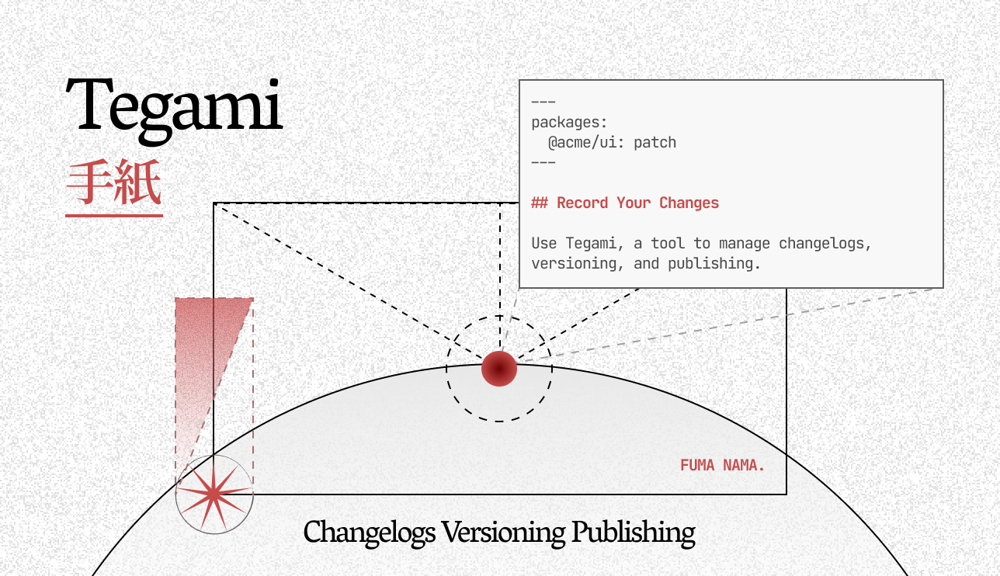

## Tegami

**Tegami (手紙)** is a tool to manage changelogs, versioning, and publishing.

It unifies the release pipeline across different programming languages and package managers.

Read [Documentation](https://tegami.fuma-nama.dev).
