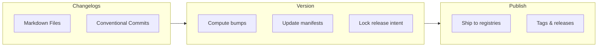

## Introduction

**Tegami** (手紙) is a tool to manage changelogs, versioning, and publishing.

It unifies the release pipeline across different programming languages and package managers.

### Why Tegami?

Previously, to release packages, you have to manually update package versions, workspace dependency ranges, write changelogs, then create a GitHub releases or post to other channels.

With CI, you might roll your own script to automate all processes. **Tegami** is built on this idea: a tool to automate all above into a Node.js script.

The key ideas of Tegami:

- **It is a script**: you create a Node.js script with Tegami, and use it to bump versions & publish packages, rather than using a CLI tool or GitHub bot. This keeps the setup simple and familiar if you started from a custom workflow.
- **Plugin first**: Most funtionalities are powered by plugins, this makes Tegami flexible enough to fit in any workflows.

### Who is using it?

Tegami is used by [Takumi](https://takumi.kane.tw), [Fumadocs](https://fumadocs.dev), [Fumapress](https://press.fumadocs.dev), and many other projects.

### Compared to Alternatives

Tegami was mainly created as a better alternative for Changesets, with solutions to some unsolved issues & problems.

- **Cross-registry version management**: support across npm, crates.io, PyPI, RubyGems, Maven Central, NuGet, Hex, and other registries via plugins.
- **Programmatic API**: allows robust use cases of the tool, such as using the `willPublish()` hook on plugins to build packages only when published.

## Release cycle

The workflow has three phases:

### Changelogs [step]

Describe your changes using Markdown files under `.tegami/` directory, or [conventional commits](https://conventionalcommits.org/en/v1.0.0).

### Version [step]

Tegami reads pending changelogs, computes version bumps (including dependency updates), and writes a publish lock file.

### Publish [step]

CI reads the publish lock and publishes packages to registries like npm and crates.io.

## Next steps

<Cards>
  <Card title="Getting Started" href="/getting-started">
    Install Tegami, create a config script, and run your first release.
  </Card>
  <Card title="Migrating from Changesets" href="/migrating-from-changesets">
    Move from `@changesets/cli` with a config and workflow mapping.
  </Card>
  <Card title="Changelogs" href="/changelog">
    Learn the changelog file format and bump styles.
  </Card>
  <Card title="Package Groups" href="/package-groups">
    Group packages that should release together.
  </Card>
  <Card title="CI Setup" href="/ci">
    Run versioning and publishing in GitHub Actions.
  </Card>
</Cards>
