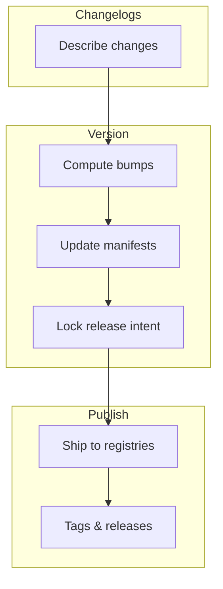

<Callout type="warn" title="In Beta">
  This project is still in beta, the API is unstable and may contains bugs, use it at your own risk.
</Callout>

## Introduction

Tegami (手紙) is a tool that manages changelogs, versioning, and publishing. Describe changes in changelog files, bump your packages, and publish to registries like npm and crates.io.

The key idea of Tegami:

- **It is a script**: you create a Node.js script with Tegami, and use it to bump versions & publish packages, rather than using a CLI tool or GitHub bot. This keeps the setup simple and familiar if you started from a custom workflow.
- **Plugin first**: Most funtionalities are powered by plugins, this makes Tegami flexible enough to fit in any workflows.

Tegami was mainly created as a better alternative for Changesets, with solutions to some unsolved issues & problems.

- **Cross-registry version management**: support across npm, cargo, and other registries via plugins.
- **Programmatic API**: allows robust use cases of the tool, such as using the `willPublish()` hook on plugins to build packages only when published.

## Release cycle

The workflow has three phases:

### Changelogs [step]

Create changelog files under `.tegami/` directory. Each file lists which packages changed and how.

### Version [step]

Tegami reads pending changelogs, computes version bumps (including dependency updates), and writes a publish lock file.

### Publish [step]

CI reads the publish lock and publishes packages to registries like npm and crates.io.

## Next steps

<Cards>
  <Card title="Getting Started" href="/getting-started">
    Install Tegami, create a config script, and run your first release.
  </Card>
  <Card title="Migrating from Changesets" href="/migrating-from-changesets">
    Move from `@changesets/cli` with a config and workflow mapping.
  </Card>
  <Card title="Changelogs" href="/changelog">
    Learn the changelog file format and bump styles.
  </Card>
  <Card title="Package Groups" href="/package-groups">
    Group packages that should release together.
  </Card>
  <Card title="CI Setup" href="/ci">
    Run versioning and publishing in GitHub Actions.
  </Card>
</Cards>
