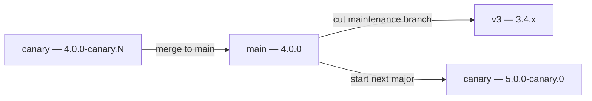

Most projects outgrow a single release line. You want the next major to be installable as a prerelease while it is still moving, and you want to keep shipping patches for the majors people are still running.

Tegami has no global "pre mode" to enter or exit. A release line is just a branch plus three settings:

- A prerelease identifier.
- An npm dist-tag.
- A version PR target.

Because your config is an ordinary Node.js script, one file can serve every branch.

## The model

This guide uses a repo where `main` carries the current stable release, `canary` develops the next major, and `v2` is still supported:

| Branch   | Version          | npm dist-tag | Installed by        |
| -------- | ---------------- | ------------ | ------------------- |
| `main`   | `3.4.x`          | `latest`     | `npm i acme`        |
| `canary` | `4.0.0-canary.N` | `canary`     | `npm i acme@canary` |
| `v2`     | `2.9.x`          | `v2`         | `npm i acme@v2`     |

Each branch runs its own `tegami ci`, opens its own Version Packages PR, and keeps its own `.tegami/publish-lock.yaml`. Lines never read each other's state, so a stuck canary release cannot block a patch on `v2`.

Over time the lines rotate:



## One config for every line

Keep a table of release lines keyed by branch name, and resolve the current branch at startup.

```ts title="scripts/tegami.mts"
import { execFileSync } from "node:child_process";
import { tegami } from "tegami";
import { runCli } from "tegami/cli";
import { github } from "tegami/plugins/github";

interface ReleaseLine {
  /** npm dist-tag. Only the current stable line may claim `latest`. */
  distTag: string;
  /** Prerelease identifier, omitted on stable lines. */
  prerelease?: string;
}

const lines: Record<string, ReleaseLine> = {
  main: { distTag: "latest" },
  canary: { distTag: "canary", prerelease: "canary" },
  v2: { distTag: "v2" },
};

function releaseBranch(): string {
  // `pull_request` events check out a merge ref, so the line is the PR base.
  if (process.env.GITHUB_BASE_REF) return process.env.GITHUB_BASE_REF;
  if (process.env.GITHUB_REF_NAME) return process.env.GITHUB_REF_NAME;

  return execFileSync("git", ["rev-parse", "--abbrev-ref", "HEAD"], {
    encoding: "utf8",
  }).trim();
}

const branch = releaseBranch();
const line = lines[branch];

if (!line) {
  throw new Error(`"${branch}" is not a release line. Add it to \`lines\` in scripts/tegami.mts.`);
}

const paper = tegami({
  packages: () => ({
    prerelease: line.prerelease,
    npm: { distTag: line.distTag },
  }),
  plugins: [
    github({
      repo: "acme/widgets",
      versionPr: {
        base: branch,
        branch: `tegami/version-packages-${branch}`,
      },
    }),
  ],
});

await runCli(paper);
```

<Callout title="Keep the file identical on every branch">

The whole point of the table is that `scripts/tegami.mts` is byte-identical on `main`, `canary`, and `v2`. Backport merges then never conflict on your release config, and adding a new line is a one-line change you cherry-pick everywhere.

Hardcoding `distTag: "v2"` directly on the `v2` branch works too, but every backport that touches the script will conflict.

</Callout>

### `prerelease`

Appends an identifier to bumped versions. On the canary line, a `major` changelog takes `3.4.1` to `4.0.0-canary.0`.

Once a package is on a prerelease line, **every** bump only advances the counter. A later `major` changelog on canary produces `4.0.0-canary.1`, not `5.0.0`. The major is decided by the first bump that enters the line, so if canary should be v5 rather than v4, cut it from a `main` that has already shipped v4.

### `npm.distTag`

This is the setting that protects your users. If a maintenance line publishes `2.9.1` with no dist-tag, npm moves `latest` to `2.9.1`, and `npm i acme` starts handing everyone the old major.

Tegami infers a dist-tag from `prerelease` when none is configured, so `canary` would be tagged correctly on its own. Maintenance lines have no prerelease identifier and therefore **no inference to fall back on**, `npm.distTag` is required there.

<Callout type="warn">

Exactly one line may use `latest`. Set every other line's `distTag` explicitly.

</Callout>

### `versionPr`

`base` points the Version Packages PR at the branch it came from, and `branch` gives each line its own PR branch. Without the second one, `canary` and `v2` both push to `tegami/version-packages` and overwrite each other's version PR.

<Callout title="Avoid Conflicts" type='warn'>
Use a `-` separator rather than `/`. Publish groups create branches at `<branch>/<group-id>`, and git cannot hold a ref at both `tegami/version-packages` and `tegami/version-packages/canary`.
</Callout>

### Using package groups instead

If your monorepo already uses [package groups](/package-groups), set the line on the group and drop the `packages` function:

```ts
tegami({
  groups: {
    acme: {
      prerelease: line.prerelease,
      npm: { distTag: line.distTag },
      syncBump: true,
    },
  },
  packages: {
    "@acme/core": { group: "acme" },
    "@acme/ui": { group: "acme" },
  },
});
```

Per-package options still win over group options, so you can pin one package to a different tag.

## CI

One workflow serves every line. Because the workflow file that runs is the one on the pushed branch, listing all branches keeps this file identical everywhere too.

```yaml title=".github/workflows/publish.yml"
name: Publish

on:
  push:
    branches:
      - main
      - canary
      - v2

jobs:
  publish:
    runs-on: ubuntu-latest
    permissions:
      contents: write
      id-token: write
      pull-requests: write
    steps:
      - uses: actions/checkout@v4
        with:
          fetch-depth: 0

      - uses: pnpm/action-setup@v6

      - uses: actions/setup-node@v6
        with:
          node-version: 24
          cache: pnpm

      - run: pnpm install --frozen-lockfile
      - run: pnpm build

      - name: Version & publish packages
        run: pnpm tegami ci
        env:
          GITHUB_TOKEN: ${{ github.token }}
```

The [pull request preview](/ci#pull-request-preview) workflows need no changes, `GITHUB_BASE_REF` already resolves a PR to the line it targets.

## Working on the canary line

Contributors write changelog files exactly as they would on `main`:

```md title=".tegami/2026-07-28-drop-node-22.md"
---
packages:
  npm:acme: major
---

# Drop Node 22

Node 24 is now required.
```

`tegami ci` on `canary` bumps `3.4.1` to `4.0.0-canary.0`, which publishes under the `canary` dist-tag:

```md title=".tegami/2026-07-28-drop-node-22.md"
---
packages:
  npm:acme:
    replay:
      - exit-prerelease(npm:acme)
---

# Drop Node 22

Node 24 is now required.
```

Once draft applied, the entry is now [replay-only](/changelog#replay). It no longer bumps anything, `.tegami/` will accumulate the full release notes for the eventual stable version.

To opt a single entry out of that (e.g. a note that only makes sense during the prerelease), give it an empty `replay: []`.

## Graduating canary to stable

When v4 is ready:

### Merge `canary` into `main` [step]

Bring both the code and the replay-only files in `.tegami/` across. `package.json` still says `4.0.0-canary.7` at this point.

### Move the line definitions [step]

`main` is now the v4 line, and canary starts on v5:

```ts
const lines: Record<string, ReleaseLine> = {
  main: { distTag: "latest" },
  canary: { distTag: "canary", prerelease: "canary" },
  v3: { distTag: "v3" }, // [!code ++]
  v2: { distTag: "v2" },
};
```

### Let CI ship it [step]

Push to `main`, nothing else is required. `main` has no `prerelease`, the package is on `4.0.0-canary.7`, and that mismatch **is itself a pending bump**. Tegami will

- Drop the prerelease to `4.0.0`.
- Replay every accumulated `exit-prerelease` entry into `CHANGELOG.md`.
- Delete the consumed files, and publishes under `latest`.

<Callout>

You do not write a changelog file to graduate a prerelease. Removing `prerelease` from the config is the whole operation.

</Callout>

## Cutting a maintenance branch

Branch from the last commit of the outgoing line, before the graduation bump landed:

```bash
git checkout -b v3 <sha-of-last-3.4.x-release>
```

Then add `v3` to `lines` and to the workflow's branch list on **every** release branch, and push. The new branch inherits its own publish lock and version PR branch from the config, so there is nothing else to set up.

Dropping a line is the reverse: delete its entry from `lines` and the workflow, and the branch stops releasing.

## Backporting a change

A fix lands on `canary` and needs to ship on `v2`.

### Cherry-pick the commit [step]

Cherry-pick the commit that **added** the changelog file (the feature commit, not the "Version Packages" etc). The `.tegami/*.md` file rides along and gets versioned independently on `v2`.

```bash
git checkout v2
git cherry-pick <sha>
git push
```

Because `v2` has no `prerelease`, there is no auto-replay: the file is consumed on the first `tegami ci` and removed.

<Callout type="warn" title="Never cherry-pick release commits">

`package.json` versions, `CHANGELOG.md`, and `.tegami/publish-lock.yaml` are per-line state. Cherry-picking a Version Packages commit will corrupt the target line's version history. Pick the change, let each line version it.

</Callout>

### Adjust the bump type if it differs [step]

A `minor` on canary often has to ship as a `patch` on a maintenance line. Edit the frontmatter after the cherry-pick, before pushing:

```md title=".tegami/2026-07-28-fix-path-join.md"
---
packages:
  npm:acme: minor # [!code --]
  npm:acme: patch # [!code ++]
---

### Fix trailing slash in joinPath

Paths no longer double up separators.
```

<Callout title="Tips">

If you would rather not touch cherry-picked content at all, cherry-pick with `-n`, drop the
changelog file, and write a fresh one describing the backport.

That costs a manual step per
backport but keeps each line's notes written for its own audience.

</Callout>

### Forward-porting [step]

When a fix lands on `v2` first, cherry-pick it up to `canary` the same way.

## Gotchas

<Accordions>
  <Accordion title={<><code>npm i acme</code> installs an old major</>}>
    A maintenance line is published without a dist-tag. Set `npm.distTag` on every
    non-`latest` line.
  </Accordion>
  <Accordion title="Two lines fight over one Version Packages PR">
    Multiple branches are using the default `versionPr.branch`. Suffix it per line.
  </Accordion>
  <Accordion title={<><code>major</code> on canary gives <code>4.0.0-canary.1</code>, not <code>5.0.0</code></>}>
    Expected: prerelease lines only advance the counter. The major is set when
    the line is created.
  </Accordion>
  <Accordion title={<><code>tegami pr preview</code> resolves the wrong line</>}>
    `GITHUB_REF_NAME` is `<n>/merge` on `pull_request`. Read `GITHUB_BASE_REF`
    first.
  </Accordion>
  <Accordion title={<><code>Changelog files pile up in <code>.tegami/</code> on canary</code></>}>
    Expected: replay-only entries waiting for `exit-prerelease`. They are
    consumed at graduation.
  </Accordion>
  <Accordion title={<><code>conventionalCommits</code> picks up canary notes on <code>main</code></>}>
    `git describe --tags` finds canary tags once canary is merged. Pass an
    explicit `from` to `generateChangelog()`.
  </Accordion>
</Accordions>

## Next steps

<Cards>
  <Card title="Changelogs" href="/changelog">
    Replay conditions and the `exit-prerelease` lifecycle.
  </Card>
  <Card title="Package Groups" href="/package-groups">
    Apply a release line to a whole product at once.
  </Card>
  <Card title="CI Setup" href="/ci">
    Build steps, publish locks, and pull request previews.
  </Card>
  <Card title="npm plugin" href="/plugins/npm">
    Dist-tags, trusted publishing, and dependency bumps.
  </Card>
</Cards>
